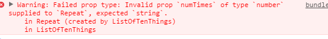

# Typechecking With PropTypes

随着项目的不断壮大，我们可能会收到很多有关类型不一致的 BUG. 对于一些项目来说，我们可以使用 Javascript 的预编译语言 `Flow` 或者 `Typescript` 来对整个项目进行类型检测，但是如果你的项目种没有使用这些预编译语言，React 也提供了一些内置的类型检测的能力。为了对组件的 `props` 进行类型检测，我们可以为组件声明一个特殊的属性 `propTypes`:

```
  class Greeting extends React.Component {
    render() {
      return (
        <h1>Hello, {this.props.name}</h1>
      );
    }
  }
  
  Greeting.propTypes = {
    name: React.PropTypes.string
  };
```

`React.PropTypes` 提供了一套用来校验组件所接收数据合法性的校验器。在上面的示例中，我们使用了 `React.PropTypes.string`. 如果有非法数据作为属性传递给了组件，那么将在 Javascript 的控制台中输出对应的警告。出于性能的考虑，React 的类型检测仅在开发环境运行。



# React.PropTypes

以下是 `React.PropTypes` 的所提供的所有校验器。

```
  MyComponent.propTypes = {
    // 我们可以声明组件的属性为 JS 的原始类型，如下：
    optionalArray: React.PropTypes.array,
    optionalBool: React.PropTypes.bool,
    optionalFunc: React.PropTypes.func,
    optionalNumber: React.PropTypes.number,
    optionalObject: React.PropTypes.object,
    optionalString: React.PropTypes.string,
    optionalSymbol: React.PropTypes.symbol,
  
    // React 可以渲染任何类型，除了 JS 的原生类型，以下类性也是可以的：
    
    // DOM 节点
    optionalNode: React.PropTypes.node,
  
    // React 元素
    optionalElement: React.PropTypes.element,
  
    // 自定义类型，使用 JS 的 instanceof 操作符
    optionalMessage: React.PropTypes.instanceOf(Message),
  
    // 指定属性值的可选范围，只要提供所有枚举值的数组即可
    optionalEnum: React.PropTypes.oneOf(['News', 'Photos']),
  
    // 除了枚举值，还可以枚举属性值的类型
    optionalUnion: React.PropTypes.oneOfType([
      React.PropTypes.string,
      React.PropTypes.number,
      React.PropTypes.instanceOf(Message)
    ]),
  
    // 如果属性是数组，可以限定数据元素的类型
    optionalArrayOf: React.PropTypes.arrayOf(React.PropTypes.number),
  
    // 如果属性值是对象，可以限定对象属性值的类型
    optionalObjectOf: React.PropTypes.objectOf(React.PropTypes.number),
  
    // 如果属性值是对象，还可以严格限制对象的属性及其类型
    optionalObjectWithShape: React.PropTypes.shape({
      color: React.PropTypes.string,
      fontSize: React.PropTypes.number
    }),
  
    // 以上所有类型校验器，都可以再链式调用 `isRequired` 来指明该属性是必须提供，如果没有提供就显示警告。
    requiredFunc: React.PropTypes.func.isRequired,
  
    // 可以通过 `any` 指定任意数据类型，加 `isRequired` 指定该属性必须提供
    requiredAny: React.PropTypes.any.isRequired,
  
    // 我们也可以指定一个自定义的校验器，如果校验失败的时候，这个校验器应该返回一个 Error 对象，而不是调用 `console.warn` 或者抛出。自定义校验器的参数依次为组件的 props, 当前属性名，组件名
    customProp: function(props, propName, componentName) {
      if (!/matchme/.test(props[propName])) {
        return new Error(
          'Invalid prop `' + propName + '` supplied to' +
          ' `' + componentName + '`. Validation failed.'
        );
      }
    },
  
    // 同理，我们也可以为 `arrayOf` `objectOf` 指定自定义的校验器，同样在校验失败时应该返回一个 Error 的实例，而不是抛出，也不是调用 `console.log`, 否则将在 `oneOfType` 中生效。
    
    // arrayOf/objectOf 的自定义校验器的将会在 array 的每个元素，object 的每个属性都调用一次，校验器的前两个参数是 array/object 本身和当前数组索引/属性 key
    
    customArrayProp: React.PropTypes.arrayOf(function(propValue, key, componentName, location, propFullName) {
      if (!/matchme/.test(propValue[key])) {
        return new Error(
          'Invalid prop `' + propFullName + '` supplied to' +
          ' `' + componentName + '`. Validation failed.'
        );
      }
    })
  };
```

### Requiring Single Child

使用 `React.PropTypes.element` 时，我们可以指定子元素只能是单独一个元素，如下：

```
  class MyComponent extends React.Component {
    render() {
      // This must be exactly one element or it will warn.
      const children = this.props.children;
      return (
        <div>
          {children}
        </div>
      );
    }
  }
  
  MyComponent.propTypes = {
    children: React.PropTypes.element.isRequired
  };
```

# Default Prop Values

我们也可以为组件的 props 提供默认值，只需要为组件声明 `defaultProps` 属性即可：

```
  class Greeting extends React.Component {
    render() {
      return (
        <h1>Hello, {this.props.name}</h1>
      );
    }
  }
  
  // Specifies the default values for props:
  Greeting.defaultProps = {
    name: 'Stranger'
  };
  
  // Renders "Hello, Stranger":
  ReactDOM.render(
    <Greeting />,
    document.getElementById('example')
  );
```

`defaultProps` 能够确保在 `Greeting` 的 `name` 属性没有指定值时能有一个默认值。由于 `propTypes` 是在 `defaultProps` 处理后开始校验的，所以 `propTypes` 也会校验 `defaultProps` 提供的默认值。